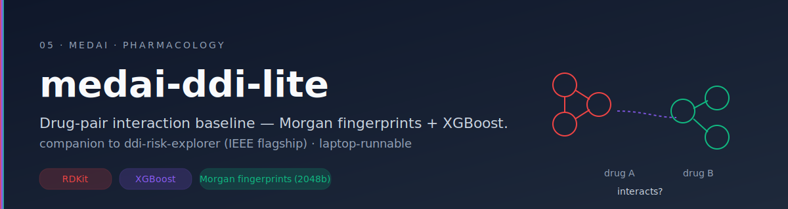
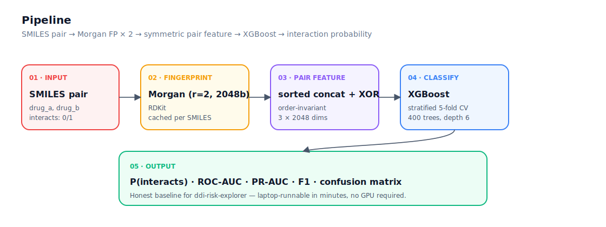

# medai-ddi-lite

A **drug-drug interaction baseline** that pairs RDKit Morgan fingerprints with XGBoost — laptop-runnable, reproducible, and built as the **honest floor** for the flagship [`ddi-risk-explorer`](https://github.com/kareemindata/ddi-risk-explorer) (IEEE-paper work).

<p align="center">
  
</p>

<p align="center">
  
  
  
  
  
</p>

<p align="center">
  <a href="#why-it-exists">Why It Exists</a> &middot;
  <a href="#what-it-does">What It Does</a> &middot;
  <a href="#why-it-matters">Why It Matters</a> &middot;
  <a href="#quick-start">Quick Start</a>
</p>

---

## Why It Exists

Polypharmacy is silently killing people. The average patient over 65 in many cohorts is on **5+ medications**, and clinically significant drug-drug interactions account for a **non-trivial slice of preventable adverse events** — but most public DDI models live in GNN papers that need a GPU, a graph framework, and an afternoon just to load the data.

The flagship in this lineage — [`ddi-risk-explorer`](https://github.com/kareemindata/ddi-risk-explorer) — pursues that direction with rigour. **This repo is the floor underneath it**: a fingerprint + XGBoost baseline that runs on a laptop in minutes, so any new method has to actually beat something honest.

> Educational and research use only. Not for clinical decision-making.

## What It Does

<p align="center">
  
</p>

- **Reads a CSV** of drug pairs with SMILES + binary `interacts` label.
- **Generates Morgan fingerprints** (radius 2, 2048 bits) for each molecule via RDKit — cached per-SMILES so repeated drugs don't pay the cost twice.
- **Combines pair features** with a **symmetric**, **order-invariant** operator: sorted-concat + bitwise XOR. `f(a,b) == f(b,a)`.
- **Trains XGBoost** with stratified 5-fold CV — 400 trees, depth 6, learning rate 0.05 — and reports ROC-AUC, PR-AUC, F1, confusion matrix.
- **Ships an inference API** — `predict_pair(smiles_a, smiles_b) → P(interacts)`.
- **Includes a synthetic data generator** (`src/toy_data.py`) so the pipeline can be smoke-tested without sourcing DrugBank or BIOSNAP first.

## Why It Matters

Most DDI papers compete on **leaderboard splits** that quietly leak. Random negative sampling and identity-aware splits hand the model the answer through chemistry it has already seen. A laptop-runnable fingerprint baseline is the **anti-leaderboard**: it tells you what the easy floor is, so you know whether a fancy method is winning or just memorising.

By keeping the baseline open and honest:

- **New methods (GNNs, pretrained chemistry models) compete against a real floor** — not a strawman.
- **Evaluation honesty becomes the headline.** Switching to scaffold-split / time-split negatives reveals how much performance was random-split sugar.
- **The flagship** ([[ddi-risk-explorer]]) **inherits a known baseline**. You don't have to re-train an unrelated baseline to claim a delta.

DDI prediction is one of the **highest-impact tabular tasks in cheminformatics**. The contribution here isn't a new model — it's the **clean, reproducible baseline the field keeps forgetting to publish**.

## Quick Start

```bash
git clone https://github.com/kareemindata/medai-ddi-lite.git
cd medai-ddi-lite

python -m venv .venv && source .venv/bin/activate
pip install -r requirements.txt

# Generate a tiny synthetic dataset to smoke-test the pipeline
python -m src.toy_data --out data/toy.csv --n 200
python -m src.train --data data/toy.csv --out runs/toy

# Or use a real DDI CSV (drug_a, drug_b, smiles_a, smiles_b, interacts)
python -m src.train --data data/pairs.csv --out runs/baseline
python -m src.predict --model runs/baseline/best_model.joblib \
  --smiles-a "CC(=O)OC1=CC=CC=C1C(=O)O" \
  --smiles-b "CN1C=NC2=C1C(=O)N(C(=O)N2C)C"
```

## Project Structure

```
src/
  fingerprints.py   # SMILES → Morgan fingerprint (RDKit)
  features.py       # order-invariant pair combiner (sorted concat + XOR)
  train.py          # stratified-CV XGBoost · metric dump · model save
  predict.py        # pair-inference CLI · predict_pair() API
  toy_data.py       # synthetic CSV for smoke testing
tests/
  test_features.py  # symmetry + shape guarantees (no RDKit needed)
assets/
  banner.svg · architecture.svg
```

## Key Design Decisions

- **Symmetric pair feature.** Order should not change the prediction — enforced at the feature level, not learned.
- **Per-SMILES fingerprint cache.** A 10k-pair dataset typically has only ~500 unique drugs; caching avoids ~95% of fingerprint computation.
- **Stratified CV.** Class balance preserved across folds so AUC variance reflects model behaviour, not class drift.
- **Honest evaluation gap noted.** Random negatives over-estimate performance — README and CV results call this out explicitly.

## Suggested Datasets

| dataset | notes |
| --- | --- |
| BIOSNAP ChCh-Miner | DrugBank-derived interaction edges, easy starter |
| DrugBank pairs (with negatives) | broader coverage, needs license |
| TWOSIDES | side-effect-driven pairs (different label semantics) |

## Caveats

- Fingerprint baselines are **weak compared to GNN / pretrained-chemistry models**. This repo is intentionally a floor, not a ceiling.
- **Random negatives over-estimate performance.** For honest evaluation, use **scaffold-split** or **time-split** negatives.
- The flagship work in [`ddi-risk-explorer`](https://github.com/kareemindata/ddi-risk-explorer) handles structured drug metadata, paper-grade evaluation, and richer feature spaces.

## Tech Stack

```
Chemistry    RDKit · Morgan fingerprints (radius=2, 2048 bits)
Model        XGBoost · 400 trees · depth 6
Pairing      symmetric concat + bitwise XOR
Validation   StratifiedKFold (n=5)
```

## Author

**Kareem Waly** — ML Engineer & IEEE-Published AI Researcher · Bridging Rigour & Impact 🧠⚗️🎓

[Portfolio](https://kareemindata.github.io) · [Google Scholar](https://scholar.google.com/citations?user=3dlL87IAAAAJ) · [LinkedIn](https://linkedin.com/in/kareemindata) · [Hugging Face](https://huggingface.co/kareem-khaled)

## License

MIT
